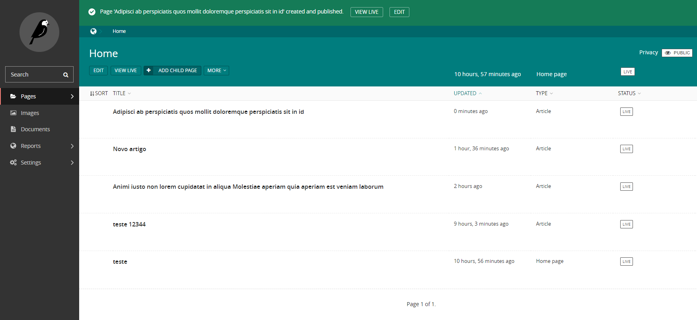

<h1 align="center">
    
</h1>

<h2 align="center">
  Medium clone
</h2>

<p align="center">
 

  
</p>

<p align="center">
  <a href="#-tecnologias">Tecnologias</a>&nbsp;&nbsp;&nbsp;|&nbsp;&nbsp;&nbsp;
  <a href="#-projeto">Projeto</a>&nbsp;&nbsp;&nbsp;|&nbsp;&nbsp;&nbsp;
  <a href="#instalação">Instalação</a>
</p>


## 🚀 Tecnologias

Esse projeto foi desenvolvido com as seguintes tecnologias:

- [Cloudinary](https://cloudinary.com/)
- [Django](https://www.djangoproject.com/)
- [Wagtail](https://wagtail.io/)


## 💻 Projeto
**Clone do medium usando Next.js no front para SSR, Django com Wagtail para CMS no backend e Cloudnary para salvar as imagens.**


## Instalação
### Pré requisitos
Ter instalado:
- [Python](https://www.python.org/downloads/)

### Backend
Necessário ter o Python instalado em sua máquina. De preferência 3.6 para cima.

#### Primeiro: renomear arquivo com variáveis de ambiente
-  **Renomear _setup/env_example.py_ para _setup/env.py_**

#### Segundo: no terminal, rodar
```sh
# Clonar esse repositório
git clone https://github.com/andre23arruda/back-medium-clone

# Entrar na pasta dos arquivos do backend
cd back-medium-clone

# Criar um ambiente virtual
python -m venv venv

# Ativar o ambiente virtual
. activate.sh
# ou se der errado (windows)
. venv/Scripts/activate
# ou se der errado (linux)
. venv/bin/activate

# Instalar os pacotes necessários
pip install -r requirements.txt

# Executar as migrações
python manage.py migrate

# Criar superusuário (Para login no admin)
echo "from django.contrib.auth.models import User; User.objects.create_superuser('teste', 'teste@example.com', 'teste1234')" | python manage.py shell
# username -> teste
# password -> teste1234

# Rodar backend
. run.sh
# ou se der errado (windows/linux)
python manage.py runserver
```

<h1 align="center">
    
